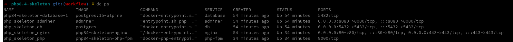

# PHP-SF-Skeleton
This is a skeleton project based on PHP 8.4 and Symfony structure.

# Architecture

This project used a docker image based on PHP 8.4. For more details about the image, check https://github.com/shinsenter/php.

# Containers in this repository



# How to run the project

Type the following command in your terminal:

```bash
docker-compose up -d
```


